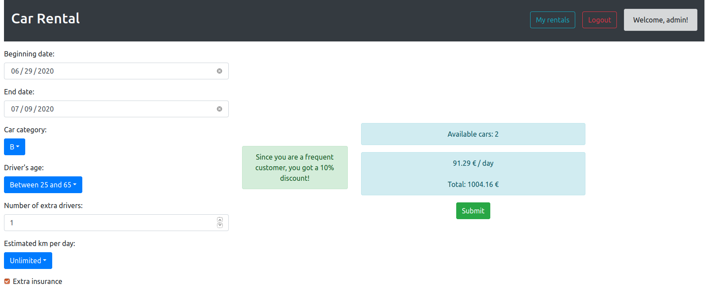

# Exam #1: "Car Rental"
## Student: s280114 Casciola Nadir 

## React client application routes

- Route `/`: The whole application

## REST API server

- GET `/api/cars`
  - request parameters: none
  - response body: list of all cars
- POST `/api/login`
  - request parameters: none
  - request body: username, password
  - response body: none
- POST `/api/logout`
  - request parameters: none
  - request body: none
  - response body: none
- GET `/api/cars/available`
  - this endpoint requires authorization
  - request parameters: category, beginning date, end date
  - response body: list of available cars' ids
- GET `/api/users/:username/rentals`
  - this endpoint requires authorization
  - request parameters: username (in the url)
  - response body: list of user's rentals
- POST `/api/payment`
  - this endpoint requires authorization
  - request parameters: none
  - request body: card number, name, cvv
  - response body: none
- POST `/api/rentals`
  - this endpoint requires authorization
  - request parameters: none
  - request body: car id, date beginning, date end, user
  - response body: none
- DELETE `/api/rentals/:id`
  - this endpoint requires authorization
  - request parameters: rental id (from the url)
  - request body: none
  - response body: none
- GET `/api/user`
  - this endpoint requires authorization
  - request parameters: none
  - response body: the username if the user was logged in, none otherwise

## Server database

- Table `users` - contains username and password of all users
- Table `cars` - contains category, brand, model of all cars
- Table `rentals` - contains start date, end date, car, user of all rentals

## Main React Components

- `CarList` (in `CarList.js`): it displays a list of cars

- `CustomNavBar` (in `CustomNavBar.js`): it displays the navbar on each page. It chooses which button to display (login or logout, new rental or my rentals...) based on the state of the application

- `FilterBar` (in `FilterBar.js`): it displays the filters of brand and category for the car list. It also manages the logic behind those filters, mantaining a list of active filters

- `FormResults` (in `FormResults.js`): it displays the results of the new rental form, which means the number of available cars (by asking the server) and the rental price (by calculating it itself). It also checks the validity of the user input in the form

- `InteractableCarList` (in `InteractableCarList.js`): it manages the logic of the filterable car list. It gets the active filters from FilterBar and tells Carlist which cars to display. It also receives the list of all cars from the server

- `LoginForm` (in `LoginForm.js`): it displays the login form and handles login attempts from the user

- `LogoutButton` (in `LogoutButton.js`): it displays the logout button and handles the logout process

- `MyRentals` (in `MyRentals.js`): it displays 3 tables: current, future and past rentals of the currently logged in user

- `PaymentModal` (in `PaymentModal.js`): when the user accepts a new rental it displays a form for the payment. It then sends the payment information to the server

- `RentalConfigurator` (in `RentalConfigurator.js`): it displays the form to make a new rental, sending the input data to FormResults

## Screenshot

## Test users

username, password

* admin, admin (frequent customer)
* john, john123 (frequent customer)
* mark, hello321
* david, 123dave
* simon, carrental123
